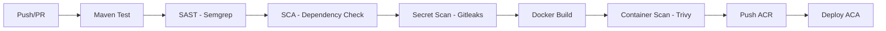

# Phase 3 - Pipeline DevSecOps (Semanas 3-5)

> HISTÓRICO — substituída como backlog desta entrega por [SEC-2026](sec-2026/README.md). Não executar cumulativamente. Checkboxes e alegações abaixo não comprovam o estado atual.

**Prioridade:** P1 - Alta | **Esforço:** ~2-3 semanas

Independente, pode iniciar cedo (paralelo com outras fases).

---

## 3.1 SAST: Semgrep

### Workflow: `.github/workflows/deploy.yml` - Adicionar job
```yaml
- name: SAST (Semgrep)
  uses: returntocorp/semgrep-action@v1
  with:
    config: >-
      p/ci
      p/java-spring
      p/secrets
    generateSarif: true
```

### Redução de risco
- Detecta: SQL injection, path traversal, hardcoded secrets, weak crypto, XSS patterns
- Roda em todo PR → bloqueia merge se finding crítico/alto

---

## 3.2 SCA: OWASP Dependency Check + Dependabot

### Maven Plugin: `pom.xml`
```xml
<plugin>
  <groupId>org.owasp</groupId>
  <artifactId>dependency-check-maven</artifactId>
  <version>9.0.0</version>
  <configuration>
    <failBuildOnCVSS>7</failBuildOnCVSS>
    <suppressionFiles>
      <suppressionFile>dependency-check-suppressions.xml</suppressionFile>
    </suppressionFiles>
  </configuration>
  <executions>
    <execution>
      <goals>
        <goal>check</goal>
      </goals>
    </execution>
  </executions>
</plugin>
```

### Dependabot: `.github/dependabot.yml`
```yaml
version: 2
updates:
  - package-ecystem: "maven"
    directory: "/"
    schedule:
      interval: "weekly"
    open-pull-requests-limit: 10
```

### Redução de risco
- Dependency Check: CVE conhecidas em dependências transitivas
- Dependabot: PRs automáticos para updates de versão

---

## 3.3 Secret Scanning: Gitleaks

### Workflow: `.github/workflows/deploy.yml`
```yaml
- name: Secret Scan (Gitleaks)
  uses: gitleaks/gitleaks-action@v2
  with:
    args: --verbose --redact
```

### Redução de risco
- Detecta secrets hardcoded no código/histórico Git
- Bloqueia commit/PR com vazamento

---

## 3.4 Container Security: Trivy

### Workflow: `.github/workflows/deploy.yml` (no job de deploy, antes do push ACR)
```yaml
- name: Container Scan (Trivy)
  uses: aquasecurity/trivy-action@master
  with:
    image-ref: ${{ env.ACR_LOGIN_SERVER }}/${{ env.IMAGE_NAME }}:${{ github.sha }}
    severity: HIGH,CRITICAL
    exit-code: 1
    ignore-unfixed: true
```

### Redução de risco
- Vulnerabilidades na imagem base (Alpine, Eclipse Temurin)
- Configurações inseguras no Dockerfile
- Bloqueia deploy se CRITICAL/HIGH

---

## 3.5 Documentação Pipeline

### Arquivo: `docs/security/pipeline-devsecops.md`
Conteúdo:
- Diagrama Mermaid do pipeline CI/CD
- Explicação por etapa: risco mitigado + ferramenta
- Exemplo execução no projeto Ford Challenge
- Matriz: etapa → risco OWASP/STRIDE mitigado

### Exemplo diagrama Mermaid


---

## Critério de Pronto Fase 3

- [ ] SAST roda em todo PR (Semgrep)
- [ ] SCA roda em todo PR (Dependency Check)
- [ ] Secret scan roda em todo PR (Gitleaks)
- [ ] Container scan roda no deploy (Trivy)
- [ ] Documento pipeline com diagrama publicado em `docs/security/pipeline-devsecops.md`

---

## Notas

- **Fail-fast:** Configurar `failBuildOnCVSS: 7` (Dependency Check) e `exit-code: 1` (Trivy) para bloquear pipeline
- **SARIF:** Semgrep gera SARIF → upload para GitHub Security tab
- **Suppression:** Criar `dependency-check-suppressions.xml` para falsos positivos conhecidos