# Pipeline DevSecOps - Ford Challenge (carsync-api-dev)

Documentação técnica da esteira automatizada de integração, segurança e entrega contínua (CI/CD/Sec) do backend Spring Boot.

---

## 1. Visão Geral e Diagrama de Fluxo

A esteira opera sob a filosofia **Shift-Left Security** e **Fail-Fast**: vulnerabilidades, segredos vazados, dependências comprometidas e falhas em containers são identificados e bloqueados nas fases mais prematuras do ciclo de desenvolvimento, impedindo artefatos inseguros de atingirem os ambientes de homologação e produção.

```mermaid
graph LR
    A[Push / PR] --> B[Maven Test]
    B --> C[SAST - Semgrep]
    C --> D[SCA - Dependency Check]
    D --> E[Secret Scan - Gitleaks]
    E --> F[Docker Build]
    F --> G[Container Scan - Trivy]
    G --> H[Push ACR]
    H --> I[Deploy ACA]

    classDef security fill:#f96,stroke:#333,stroke-width:2px;
    class C,D,E,G security;
```

---

## 2. Detalhamento das Etapas do Pipeline

### 2.1 Maven Test (Testes de Unidade e Integração)
- **Ferramentas:** Maven Surefire, JUnit 5, Spring Boot Test, H2 In-Memory.
- **Gatilho:** Pushes e Pull Requests na branch `main`.
- **Comando:** `mvn test -Dspring.profiles.active=test`
- **Risco Mitigado:** Regressões funcionais, falhas na lógica de negócio (Customer 360, Churn Risk, Lead Management), quebra de integridade de validações (`@ValidCpf`, `@StrongPassword`).
- **Política:** Falha de qualquer teste unitário ou de integração encerra o pipeline imediatamente. Relatórios JUnit são arquivados como artefatos de build.

### 2.2 SAST: Static Application Security Testing (Semgrep)
- **Ferramenta:** `returntocorp/semgrep-action@v1`
- **Configuração de Regras:**
  - `p/ci`: regras consolidadas para integração contínua.
  - `p/java-spring`: detecção de vulnerabilidades específicas de Spring Framework (Spring Security, Spring MVC, Spring Data).
  - `p/secrets`: busca heurística por segredos expostos em código estático.
- **Exportação:** Geração de relatório SARIF (`semgrep.sarif`) publicado na aba *Security > Code scanning* do GitHub.
- **Risco Mitigado:**
  - Injeção de código / SQL Injection.
  - Path Traversal e Insecure Direct Object References (IDOR).
  - Criptografia fraca (ex.: uso inadequado de DES, MD5, SHA-1).
  - Configurações inseguras de CORS, CSRF e cookies.
- **Política:** Bloqueia merge do Pull Request em caso de findings com severidade crítica ou alta.

### 2.3 SCA: Software Composition Analysis (OWASP Dependency Check + Dependabot)
- **Ferramentas:**
  - `org.owasp:dependency-check-maven:9.0.0` (execução no CI via `mvn org.owasp:dependency-check-maven:check`).
  - `.github/dependabot.yml`: monitoramento semanal automatizado para ecossistemas `maven` e `github-actions`.
- **Configurações:**
  - `failBuildOnCVSS: 7`: falha o build caso qualquer CVE com escore CVSS igual ou superior a 7.0 (High/Critical) seja encontrada.
  - `dependency-check-suppressions.xml`: arquivo controlado para supressão justificada de falsos positivos conhecidos.
- **Risco Mitigado:** Vulnerabilidades conhecidas (CVEs) em bibliotecas diretas e transitivas (Jackson, Spring Boot Starter, Hibernate, JJWT, Driver Postgres).
- **Política:** Bloqueio imediato do build caso uma vulnerabilidade com CVSS >= 7.0 não esteja mapeada e justificada no arquivo de supressão. O relatório HTML completo é publicado como artefato do workflow.

### 2.4 Secret Scanning (Gitleaks)
- **Ferramenta:** `gitleaks/gitleaks-action@v2`
- **Configuração:** `args: --verbose --redact` executado com checkout total do histórico (`fetch-depth: 0`).
- **Risco Mitigado:** Detecção de credenciais, chaves privadas, tokens JWT, HMAC secrets, strings de conexão PostgreSQL ou Azure Service Principal commitados inadvertidamente no repositório.
- **Política:** Bloqueia qualquer commit ou Pull Request que introduza credenciais no histórico do Git. Os valores nos logs são automaticamente mascarados (`--redact`).

### 2.5 Container Security (Trivy)
- **Ferramenta:** `aquasecurity/trivy-action@master`
- **Gatilho:** Executado no job de deploy, após o `docker build` da imagem local e estritamente **antes** do envio ao Azure Container Registry (`docker push`).
- **Alvo:** Imagem local `${{ env.ACR_LOGIN_SERVER }}/${{ env.IMAGE_NAME }}:${{ github.sha }}` baseada em `eclipse-temurin:21-jre-alpine`.
- **Configuração:**
  - `severity: HIGH,CRITICAL`
  - `exit-code: 1`
  - `ignore-unfixed: true`
- **Risco Mitigado:**
  - Vulnerabilidades nos pacotes do sistema operacional base (Alpine Linux).
  - Pacotes runtime Java desatualizados no container.
  - Binários e bibliotecas adicionadas durante a montagem da imagem Docker.
- **Política:** Se houver qualquer vulnerabilidade corrigível de nível HIGH ou CRITICAL, o comando retorna código de saída `1`, abortando o push para o Azure Container Registry e impedindo o deploy.

### 2.6 Deploy Seguro (ACR + Azure Container Apps)
- **Ferramentas:** `azure/docker-login@v2`, `azure/login@v2`, Azure CLI (`az containerapp update`).
- **Mecanismo:** Apenas imagens aprovadas por todos os gates de segurança são enviadas ao registro privado (ACR) e implantadas no Azure Container Apps com variáveis de ambiente e secrets nativos injetados de forma segura.

---

## 3. Matriz de Mapeamento: Etapa vs. OWASP Top 10 e STRIDE

| Etapa da Esteira | Ferramenta | OWASP Top 10 (2021) Mitigado | Ameaças STRIDE Mitigadas | Ação / Threshold de Bloqueio |
|---|---|---|---|---|
| **Testes Automatizados** | JUnit 5 / Surefire | A04:2021 - Insecure Design | Spoofing, Tampering | Falha em qualquer asserção de teste |
| **SAST** | Semgrep | A01:2021 - Broken Access Control A03:2021 - Injection A07:2021 - Identification & Auth Failures | Spoofing, Tampering, Elevation of Privilege | Severidade CRITICAL ou HIGH bloqueia o PR |
| **SCA** | OWASP Dependency-Check + Dependabot | A06:2021 - Vulnerable and Outdated Components | Tampering, Information Disclosure, Denial of Service | CVSS >= 7.0 bloqueia o build (`failBuildOnCVSS`) |
| **Secret Scanning** | Gitleaks | A02:2021 - Cryptographic Failures A07:2021 - Identification & Auth Failures | Information Disclosure, Spoofing | Qualquer pattern de segredo detectado falha o job |
| **Container Scan** | Trivy | A05:2021 - Security Misconfiguration A06:2021 - Vulnerable Components | Elevation of Privilege, Tampering, DoS | Falha com `exit-code: 1` para HIGH/CRITICAL corrigível |
| **Deploy Seguro** | ACA Native Secrets | A02:2021 - Cryptographic Failures A05:2021 - Security Misconfiguration | Information Disclosure, Elevation of Privilege | Abortado se qualquer etapa anterior falhar |

---

## 4. Exemplo Prático de Execução no Projeto Ford Challenge

### Cenário 1: Pull Request de Desenvolvedor (Verificação Completa Sem Deploy)
1. Desenvolvedor abre PR para a branch `main` com uma nova regra de predição de churn.
2. O workflow `.github/workflows/deploy.yml` é disparado pelo gatilho `pull_request`.
3. **Etapa 1:** `Maven Test` executa todos os 130+ testes com perfil de teste isolado. Sucesso.
4. **Etapa 2:** `SAST (Semgrep)` analisa o código-fonte contra os conjuntos de regras `p/ci`, `p/java-spring` e `p/secrets`. O arquivo SARIF é gerado e disponibilizado para revisão no PR.
5. **Etapa 3:** `SCA (OWASP Dependency Check)` analisa todas as dependências declaradas e transitivas no `pom.xml`. Nenhuma CVE não suprimida com CVSS >= 7 é encontrada.
6. **Etapa 4:** `Secret Scan (Gitleaks)` valida todo o diff do PR em busca de chaves privadas ou tokens acidentais.
7. **Etapa 5:** O job `deploy` é automaticamente ignorado (`skipped`), pois o evento é `pull_request` e não `push` direto na branch `main`.
8. O PR recebe os status checks positivos e está liberado para revisão de pares e merge.

### Cenário 2: Bloqueio Preventivo por Vulnerabilidade em Dependência (Falha Simulada)
1. Uma dependência externa com CVE crítica conhecida (ex.: vulnerabilidade RCE com CVSS 9.8) é incluída no `pom.xml`.
2. O pipeline executa `Maven Test` com sucesso.
3. No job `SCA (OWASP Dependency Check)`, a análise identifica a vulnerabilidade com CVSS 9.8.
4. Como `9.8 >= failBuildOnCVSS (7)`, o plugin encerra a execução com erro (`BUILD FAILURE`).
5. Os jobs subsequentes (`secret-scan` e `deploy`) são cancelados.
6. O relatório `dependency-check-report.html` é arquivado nos artefatos da execução do GitHub Actions para auditoria e remediação imediata pelo time de desenvolvimento.

### Cenário 3: Bloqueio Preventivo por Imagem de Container Vulnerável
1. Uma imagem Docker é gerada durante o deploy na branch `main`.
2. O Trivy realiza a inspeção dos pacotes do Alpine Linux e camadas do JRE.
3. Caso um pacote nativo do Alpine (ex.: `busybox`, `libssl`) possua vulnerabilidade CRITICAL corrigível:
   - Trivy reporta a CVE correspondente com detalhes de correção.
   - Trivy encerra com código `1`.
   - O comando `docker push` **nunca é chamado**. O Azure Container Registry permanece intacto e a aplicação em produção no Azure Container Apps continua executando a versão estável anterior sem interrupção (zero downtime e zero contaminação).
