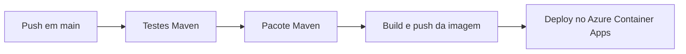
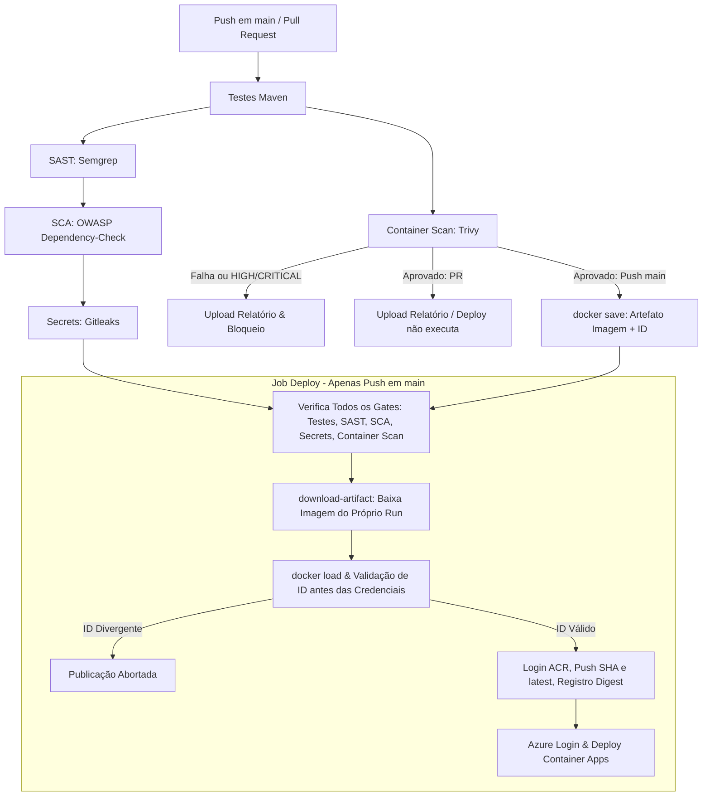

# Pipeline DevSecOps — Ford Challenge

## Escopo e estado inicial

Base avaliada: `52565edf5d81beb593c1cb78f8d23e49820cd076`. O fluxo inicial em `.github/workflows/deploy.yml` executa somente em `push` para `main`: testes Maven, pacote, build e push da imagem e deploy no Azure Container Apps. Não havia SAST, SCA, secret scanning ou análise de container.

## Fluxo atual



## Fluxo proposto



## Etapas, entradas e riscos

| Etapa | Entrada | Risco reduzido | Resultado esperado |
|---|---|---|---|
| Testes | Código e perfil `test` | Regressões funcionais antes do deploy | Relatórios Surefire; falha bloqueia dependentes |
| SAST | Código Java/Spring e configuração | Injeções, uso inseguro de APIs e segredos no código | Semgrep bloqueia achados e gera SARIF |
| SCA | `pom.xml` e árvore Maven | Bibliotecas com vulnerabilidades conhecidas | Dependency-Check falha em CVSS >= 7 e gera HTML |
| Atualização | Maven e GitHub Actions | Permanência em versões antigas | Dependabot abre PRs semanais; não substitui SCA |
| Secret scanning | Histórico Git completo | Credenciais e tokens versionados | Gitleaks falha sem revelar o valor detectado |
| Container scan | JAR empacotado e Dockerfile | CVEs HIGH/CRITICAL no runtime antes do merge | Trivy bloqueia antes do deploy; relatório arquivado |
| Transferência imagem | Imagem aprovada (push na main) | Divergência entre imagem analisada e publicada | `docker save` gera artefato do run; sem rebuild no deploy |
| Publicação/Deploy | Artefato do run e credenciais | Deploy de artefato não verificado ou vindo de PR | Validação do ID antes de credenciais; deploy da tag SHA |

## Execução e gates integrados

O workflow executa testes, Semgrep, Dependency-Check, Gitleaks e Trivy Container Scan em `push` e `pull_request` para `main`.
Após a conclusão dos testes Maven, o job `container-scan` executa em paralelo à cadeia SAST/SCA/secrets, garantindo análise da imagem antes do merge sem depender de segredos NVD ou credenciais cloud.

Principais diretrizes de segurança aplicadas:
1. **Permissões mínimas**: Permissão global `contents: read`. Apenas o job SAST recebe `security-events: write` para envio do SARIF. Nenhum segredo cloud é exposto ao PR.
2. **Scan antecipado e evidência de falha**: O job `container-scan` constrói a imagem com tag SHA imutável e executa Trivy com gate `HIGH,CRITICAL`, `exit-code: 1` e `ignore-unfixed: true`. O relatório e a identidade do container são gerados e enviados como artefato (`container-scan-report`, retenção de 14 dias) com `if: always()`, preservando o diagnóstico tanto em aprovação quanto em falha sem expor segredos.
3. **Publicação somente de imagem aprovada**: Apenas em `push` na `main`, a imagem aprovada pelo Trivy é exportada via `docker save` e arquivada como artefato do próprio run (`approved-container-image`, retenção de 1 dia, `compression-level: 0`, `if-no-files-found: error`).
4. **Sem rebuild e verificação pré-credenciais no Deploy**: O job `deploy` depende de todos os gates (`needs: [test, sast, sca, secret-scan, container-scan]`) e executa somente em `push` na `main`. Ele baixa o artefato usando `actions/download-artifact` fixada por SHA verificado (`d3f86a106a0bac45b974a628896c90dbdf5c8093 # v4.3.0`), carrega a imagem via `docker load` e **valida a correspondência exata do ID local antes de qualquer autenticação ACR ou Azure**. Qualquer divergência ou ausência de artefato interrompe a execução antes da leitura de credenciais.
5. **Rastreabilidade e evidência persistida**: As tags SHA e latest são publicadas e o digest final no registry é capturado de forma estrita (sem fallbacks permissivos) e gravado em `deploy-evidence/published-digest.txt`, publicado como artefato `deploy-evidence` (retenção de 30 dias) sem expor credenciais.

## Como reproduzir

```bash
# 1. Testes e empacotamento da aplicação
mvn clean test -Dspring.profiles.active=test
mvn clean package -DskipTests

# 2. Análise estática de dependências e segredos
mvn -B org.owasp:dependency-check-maven:check

gitleaks detect \
  --source . \
  --config .gitleaks.toml \
  --gitleaks-ignore-path .gitleaksignore \
  --redact

# 3. Build da imagem e scan de container com Trivy
docker build -t carsync-api:sec-2026 .
trivy image --severity HIGH,CRITICAL --ignore-unfixed --exit-code 1 carsync-api:sec-2026

# 4. Smoke test automatizado de container, transferência e gates
# Retorna exit code 2 em pré-condições bloqueadas e propaga status do Trivy imediatamente
./docs/security/sec-2026/01-pipeline/check-container.sh carsync-api:sec-2026 /tmp/container-smoke-output
```

## Evidência observada em 2026-09-24

| Verificação | Ambiente | Resultado |
|---|---|---|
| Testes Maven | Local, Java 21 | 212 testes, 0 falhas, `BUILD SUCCESS` |
| Gitleaks 8.30.1 | Local | 151 commits e ~9,58 MB; zero vazamentos após exceções estreitas revisadas |
| Fixture sintética Gitleaks | Local, fora do repositório | 1 achado, exit code 1; fixture removida |
| Dependency-Check 9.0.0 | Local | Bloqueado: NVD HTTP 403 e ausência de dados locais |
| Semgrep | Local | Bloqueado: CLI ausente e Docker sem acesso ao daemon |
| Build/Trivy | Local | Bloqueado: acesso negado ao socket Docker; nenhum digest inventado |
| GitHub Actions | Remoto, commit `6947874` | [Run 36020010271](https://github.com/CarSync-ford/carsync-back/actions/runs/36020010271): testes e SAST aprovados; SCA reprovado; Gitleaks e deploy não executados |
| Deploy Azure | Remoto | Não executado; nenhum deploy declarado |

## Atualização de dependências — 2026-09-24

Após reprovação do SCA remoto no run `36020010271` (12 dependências vulneráveis, 163 achados) e nova reprovação no run `36046716450` com commit `c217e15` (8 arquivos, 7 componentes, 58 CVEs únicos devido a patches Spring 6.x Enterprise-only), a aplicação foi migrada para **Spring Boot 4.1.1** com suporte público continuado.

Versões publicadas no Maven Central e resolvidas por `mvn -B dependency:tree`:

| Componente | Antes (c217e15) | Spring Boot 4.1.1 |
|---|---|---|
| Spring Boot | 3.5.16 | 4.1.1 |
| Spring Framework | 6.2.19 | 7.0.9 (BOM) |
| Spring Security | 6.5.11 | 7.1.1 (BOM) |
| Spring Data JPA | 3.5.13 | 4.1.1 (BOM) |
| Tomcat (override) | 10.1.55 | 11.0.26 |
| Jackson aplicação | 2.21.4 | 3.1.5 (`tools.jackson`) |
| Jackson 2 transitivo | 2.21.4 | 2.21.5 (BOM compatível) |
| PostgreSQL JDBC | 42.7.11 | 42.7.13 (BOM) |
| Springdoc | 2.8.17 | 3.1.1 |
| Swagger UI (WebJar) | 5.32.2 | 5.32.15 (DOMPurify 3.4.13 empacotado) |
| Flyway | 10.21.0 | 12.4.0 (BOM) |
| Hibernate / Envers | 6.6.53.Final | 7.4.5.Final (BOM) |
| Commons Lang | 3.20.0 | 3.20.0 (BOM) |
| Log4j API / bridge | 2.25.5 | 2.25.5 (BOM) |

Adaptações necessárias de código e testes:
- `SecurityConfig.java`: `requiresChannel` substituído por `redirectToHttps(Customizer.withDefaults())` do Spring Security 7.
- Pacotes de teste migrados para módulos modulares Boot 4: `org.springframework.boot.webmvc.test.autoconfigure.AutoConfigureMockMvc`, `MockMvcPrint`, `TestRestTemplate` em `org.springframework.boot.resttestclient`, `DataJpaTest` em `org.springframework.boot.data.jpa.test.autoconfigure`, e `ObjectMapper` em `tools.jackson.databind`.
- `spring-boot-starter-flyway`, `spring-boot-starter-webmvc-test`, `spring-boot-data-jpa-test`, `spring-boot-restclient` e `spring-boot-starter-security-test` adicionados como starters modulares.
- `PayloadLimitTest`: `HttpStatus.PAYLOAD_TOO_LARGE` alinhado ao nome RFC 9110 `HttpStatus.CONTENT_TOO_LARGE`.
- `HttpsSecurityTest`: `RequestPostProcessor` definindo esquema HTTPS para `HttpsRedirectFilter`.

`mvn -B clean test -Dspring.profiles.active=test`: **BUILD SUCCESS**, 212 testes, zero falhas/erros/skips (38.5s). Flyway migrou 9 versões até v10 no H2. OpenAPI gerado com sucesso em `/v3/api-docs`.

Supressões do Dependency-Check permanecem vazias (`dependency-check-suppressions.xml`) e gate CVSS >= 7 inalterado. O scan de SCA com as novas dependências foi executado no GitHub Actions com sucesso no run `36074219523`.

## Evidência observada em 2026-09-25

| Verificação | Ambiente | Resultado |
|---|---|---|
| GitHub Actions PR #33 | Remoto, commit `c7af363` | [Run 36074219523](https://github.com/CarSync-ford/carsync-back/actions/runs/36074219523): **SCA aprovado** (4m39s, 0 CVEs CVSS >= 7); testes (1m10s), SAST (28s) e Gitleaks (15s) verdes; deploy skipped por se tratar de PR |
| Workflow YAML | Local, Python 3 PyYAML | `deploy.yml` validado com sucesso (`safe_load`) |
| Smoke test container | Local, `check-container.sh` | Teste de ID divergente: **PASS**; pré-condição de daemon Docker bloqueada retorna **exit code 2** com logs duráveis (`blocked.log`, `docker-info.log`) |
| Docker daemon | Local | Bloqueado: permissão negada no socket `/var/run/docker.sock` (nenhuma alteração de permissão ou sudo executada) |
| Trivy CLI / actionlint | Local | Não instalados no PATH local |
| Job `container-scan` | Workflow `.github/workflows/deploy.yml` | Implementado para PR e push na main: scan Trivy com tag SHA, envio de relatório com `if: always()`, geração de artefato da imagem em push na main (`compression-level: 0`, `if-no-files-found: error`) |
| Transferência no Deploy | Workflow `.github/workflows/deploy.yml` | Rebuild eliminado; `actions/download-artifact` fixada por SHA oficial `d3f86a106a0bac45b974a628896c90dbdf5c8093`; validação estrita do ID local antes de credenciais |
| Deploy Azure / Registry digest | Remoto | Não executado; especificação separa verificação de PR de deploy cloud real (nenhum deploy cloud ou digest de registry simulado) |

## Tratamento de falhas

- Semgrep encontra padrão inseguro: job SAST falha e SARIF é enviado quando permitido.
- Dependency-Check encontra CVSS >= 7: Maven falha e preserva o HTML quando produzido.
- Gitleaks encontra segredo não revisado: job falha; saída não deve revelar valor.
- Trivy encontra HIGH/CRITICAL: job `container-scan` falha com exit code 1; relatório é preservado e enviado como artefato; imagem aprovada não é salva e `deploy` não inicia.
- Artefato ausente, corrompido ou com ID divergente: job `deploy` falha imediatamente durante a validação prévia, antes de carregar credenciais ACR ou Azure.
- Captura de digest no registry: digest vazio ou inválido aborta imediatamente a publicação com exit code 1; evidência persistida em `deploy-evidence/published-digest.txt`.
- Falha de scanner por infraestrutura também bloqueia o fluxo; não é convertida em aprovação.

Dependabot e Dependency-Check não duplicam função: Dependabot propõe atualização de versões; Dependency-Check compara dependências resolvidas com bases de vulnerabilidades.

## Limites e riscos residuais

Scanners reduzem classes conhecidas de risco, mas não substituem revisão humana, testes de autorização ou validação em produção. `ignore-unfixed: true` evita gate sem ação corretiva disponível, portanto CVEs sem correção permanecem risco residual. Allowlists do Gitleaks são limitadas ao cache Graphify e a cinco fingerprints históricos revisados; novos achados continuam bloqueados.
O SCA foi comprovado verde remotamente no run `36074219523`. A execução remota do novo job `container-scan` e a publicação real com digest no registry ainda precisam ser verificadas após autorização de push/merge, sem simulação. A ausência de deploy real permanece explícita.

## Correção de imagem — 2026-09-25

Após reprovação do Trivy no PR #34 (run `36142306403`), a imagem-base e o Application Insights agent foram atualizados:

| Componente | Antes (run 36142306403) | Correção |
|---|---|---|
| Imagem-base | `eclipse-temurin:21-jre-alpine` (tag flutuante, Alpine 3.24, libexpat 2.8.4-r0) | `eclipse-temurin:21-jre-alpine-3.24@sha256:1a29e1fe337eb28b5bec30f0ee8ed29f0ff80ab6f75dcf9313efe82911065a52` fixada por digest; `apk add --no-cache --upgrade 'libexpat>=2.8.5-r0'` |
| Application Insights agent | 3.5.4 | 3.7.10 (release 19/09/2026) |
| Checksum agent.jar | n/a | `93a70c8f5d364c7e777f6c4d1b235dba91aef8448bd3fa94359f1d7f3e2eb0ec` validado no build |
| Dependências internas do agent (lockfile 3.7.10) | Jackson 2.17.2, Netty 4.1.112.Final, json-smart 2.5.0 | Jackson core/databind 2.22.2; Netty handler/http 4.2.18.Final; json-smart removido/atualizado |

### Comparação SCA × Trivy (runs 36020010271, 36046716450 vs 36142306403)

- **SCA 36020010271**: 132 IDs únicos (138 CVE, 25 GHSA). Dependências da aplicação.
- **SCA 36046716450**: 55 IDs únicos (59 CVE, 16 GHSA). Após migração Spring Boot 4.1.1.
- **Trivy 36142306403**: 24 IDs únicos (1 OS Alpine libexpat, 23 em agent.jar 3.5.4, 0 em app.jar).

**IDs idênticos entre SCA e Trivy:**
- `CVE-2026-54512` e `CVE-2026-54513` (Jackson databind 2.17.2) aparecem em SCA 36020010271 (app.jar) e Trivy 36142306403 (agent.jar). Mesmo CVE, cópias distintas da biblioteca.
- SCA 36046716450: 0 sobreposição — app.jar já atualizado para Jackson 2.21.4.
- Nenhum achado no app.jar no scan Trivy; achados restantes são exclusivos do agent.jar antigo e pacote OS.

**Conclusão:** SCA verde não garante imagem limpa. Agent.jar carrega dependências próprias não gerenciadas pelo pom.xml. Correção via atualização do agente, não supressão de gate.

### Evidência observada em 2026-09-25 (atualizada)

| Verificação | Ambiente | Resultado |
|---|---|---|
| GitHub Actions PR #33 | Remoto, commit `c7af363` | [Run 36074219523](https://github.com/CarSync-ford/carsync-back/actions/runs/36074219523): SCA aprovado; testes, SAST, Gitleaks verdes; deploy skipped |
| GitHub Actions PR #34 | Remoto, commit `21fcb12` | [Run 36142306403](https://github.com/CarSync-ford/carsync-back/actions/runs/36142306403): Trivy reprovou (25 achados); testes, SAST, SCA, Gitleaks verdes; deploy skipped |
| GitHub Actions PR #34 | Remoto, commit `7f735d3` | [Run 36148042299](https://github.com/CarSync-ford/carsync-back/actions/runs/36148042299): **Todos 5 gates VERDES**; testes, SAST, SCA, Gitleaks, Trivy (0 HIGH/CRITICAL); deploy skipped por PR |
| Dockerfile | Worktree `sec-2026/01-pipeline` | Atualizado: base Alpine 3.24 fixada por digest, libexpat 2.8.5-r0, AI agent 3.7.10 com checksum |
| Workflow `container-scan` | Workflow `.github/workflows/deploy.yml` | Smoke JVM/agent load, verificação libexpat/agent checksum, relatório com `if: always()` |

### Execução concluída — 2026-09-25

- Nova execução remota do job `container-scan` com Dockerfile atualizado: run 36148042299.
- Re-scan obrigatório (Dockerfile alterado): T3.C2 VERIFICADO.
- Gate Trivy HIGH/CRITICAL APROVADO: 0 vulnerabilidades em alpine 3.24.2 e app/app.jar. Achados anteriores em libexpat (CVE-2026-42587) e agent.jar 3.5.4 (23 IDs, incl. CVE-2026-54512, CVE-2026-54513) eliminados.
- Smoke test JVM + agent load OK; libexpat 2.8.5-r0 confirmado; agent 3.7.10 checksum validado.
- Deploy real permanece explícita ausência; não simulado.
