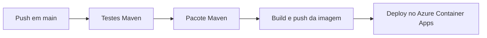
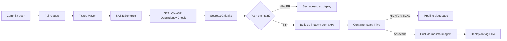

# Pipeline DevSecOps — Ford Challenge

## Escopo e estado inicial

Base avaliada: `52565edf5d81beb593c1cb78f8d23e49820cd076`. O fluxo inicial em `.github/workflows/deploy.yml` executa somente em `push` para `main`: testes Maven, pacote, build e push da imagem e deploy no Azure Container Apps. Não havia SAST, SCA, secret scanning ou análise de container.

## Fluxo atual

## Fluxo proposto

## Etapas, entradas e riscos

| Etapa | Entrada | Risco reduzido | Resultado esperado |
|---|---|---|---|
| Testes | Código e perfil `test` | Regressões funcionais antes do deploy | Relatórios Surefire; falha bloqueia dependentes |
| SAST | Código Java/Spring e configuração | Injeções, uso inseguro de APIs e segredos no código | Semgrep bloqueia achados e gera SARIF |
| SCA | `pom.xml` e árvore Maven | Bibliotecas com vulnerabilidades conhecidas | Dependency-Check falha em CVSS >= 7 e gera HTML |
| Atualização | Maven e GitHub Actions | Permanência em versões antigas | Dependabot abre PRs semanais; não substitui SCA |
| Secret scanning | Histórico Git completo | Credenciais e tokens versionados | Gitleaks falha sem revelar o valor detectado |
| Build | JAR e Dockerfile existente | Divergência entre artefato analisado e publicado | Imagem identificada pela tag imutável do commit |
| Container scan | Imagem local destinada ao deploy | CVEs HIGH/CRITICAL no runtime | Trivy bloqueia antes de qualquer push |
| Push/deploy | Imagem aprovada e credenciais protegidas | Deploy de artefato não verificado ou vindo de PR | Somente `push` em `main`; deploy usa tag SHA |

## Limites da análise

Scanners reduzem classes conhecidas de risco, mas não substituem revisão humana, testes de autorização ou validação em produção. Execuções locais, CI remoto e deploy real serão identificados separadamente. Nenhuma execução remota é presumida neste documento.
