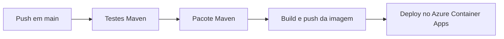
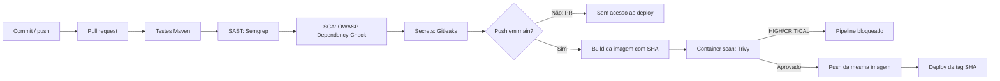

# Pipeline DevSecOps — Ford Challenge

## Escopo e estado inicial

Base avaliada: `52565edf5d81beb593c1cb78f8d23e49820cd076`. O fluxo inicial em `.github/workflows/deploy.yml` executa somente em `push` para `main`: testes Maven, pacote, build e push da imagem e deploy no Azure Container Apps. Não havia SAST, SCA, secret scanning ou análise de container.

## Fluxo atual



## Fluxo proposto



## Etapas, entradas e riscos

| Etapa | Entrada | Risco reduzido | Resultado esperado |
|---|---|---|---|
| Testes | Código e perfil `test` | Regressões funcionais antes do deploy | Relatórios Surefire; falha bloqueia dependentes |
| SAST | Código Java/Spring e configuração | Injeções, uso inseguro de APIs e segredos no código | Semgrep bloqueia achados e gera SARIF |
| SCA | `pom.xml` e árvore Maven | Bibliotecas com vulnerabilidades conhecidas | Dependency-Check falha em CVSS >= 7 e gera HTML |
| Atualização | Maven e GitHub Actions | Permanência em versões antigas | Dependabot abre PRs semanais; não substitui SCA |
| Secret scanning | Histórico Git completo | Credenciais e tokens versionados | Gitleaks falha sem revelar o valor detectado |
| Build | JAR e Dockerfile existente | Divergência entre artefato analisado e publicado | Imagem identificada pela tag imutável do commit |
| Container scan | Imagem local destinada ao deploy | CVEs HIGH/CRITICAL no runtime | Trivy bloqueia antes de qualquer push |
| Push/deploy | Imagem aprovada e credenciais protegidas | Deploy de artefato não verificado ou vindo de PR | Somente `push` em `main`; deploy usa tag SHA |

## Execução e gates integrados

O workflow executa testes, Semgrep, Dependency-Check e Gitleaks em `push` e `pull_request` para `main`. Cada job depende do anterior; qualquer falha impede os jobs seguintes. O job `deploy` exige todos os gates e também verifica `github.event_name == 'push' && github.ref == 'refs/heads/main'`. Assim, PR não confiável não recebe credenciais ACR/Azure e não publica ou implanta imagem.

Permissão global: `contents: read`. Somente o job SAST recebe `security-events: write` para publicar SARIF. Credenciais existentes permanecem em GitHub Secrets; esta frente não alterou segredos nem infraestrutura cloud.

No deploy, a imagem recebe a tag imutável `${{ github.sha }}`. Trivy verifica essa mesma referência local antes dos comandos `docker push`; HIGH/CRITICAL com correção disponível causa exit code 1. O deploy usa a tag SHA aprovada, não depende da tag mutável `latest`.

## Como reproduzir

```bash
mvn clean test -Dspring.profiles.active=test
mvn -B org.owasp:dependency-check-maven:check

gitleaks detect \
  --source . \
  --config .gitleaks.toml \
  --gitleaks-ignore-path .gitleaksignore \
  --redact

docker build -t carsync-api:sec-2026 .
trivy image --severity HIGH,CRITICAL --ignore-unfixed --exit-code 1 carsync-api:sec-2026
```

## Evidência observada em 2026-09-24

| Verificação | Ambiente | Resultado |
|---|---|---|
| Testes Maven | Local, Java 21 | 212 testes, 0 falhas, `BUILD SUCCESS` |
| Gitleaks 8.30.1 | Local | 151 commits e ~9,58 MB; zero vazamentos após exceções estreitas revisadas |
| Fixture sintética Gitleaks | Local, fora do repositório | 1 achado, exit code 1; fixture removida |
| Dependency-Check 9.0.0 | Local | Bloqueado: NVD HTTP 403 e ausência de dados locais |
| Semgrep | Local | Bloqueado: CLI ausente e Docker sem acesso ao daemon |
| Build/Trivy | Local | Bloqueado: acesso negado ao socket Docker; nenhum digest inventado |
| GitHub Actions | Remoto, commit `6947874` | [Run 36020010271](https://github.com/CarSync-ford/carsync-back/actions/runs/36020010271): testes e SAST aprovados; SCA reprovado; Gitleaks e deploy não executados |
| Deploy Azure | Remoto | Não executado; nenhum deploy declarado |

## Atualização de dependências — 2026-09-24

Após reprovação do SCA remoto, versões publicadas no Maven Central e resolvidas por `mvn -B dependency:tree`:

| Componente | Antes | Após atualização |
|---|---|---|
| Spring Boot | 3.3.2 | 3.5.16 |
| Spring Framework | 6.1.11 | 6.2.19 |
| Spring Security | 6.3.1 | 6.5.11 |
| Tomcat | 10.1.26 | 10.1.55 |
| Jackson Databind | 2.17.2 | 2.21.4 |
| PostgreSQL JDBC | 42.7.3 | 42.7.11 |
| Springdoc | 2.5.0 | 2.8.17 |
| Swagger UI | 5.13.0 | 5.32.2 |
| Commons Lang | 3.14.0 | 3.20.0 |
| Log4j API / bridge SLF4J | 2.23.1 | 2.25.5 |

Overrides necessários porque BOM mantém Commons Lang 3.17.0 e Log4j 2.24.3. [CVE-2025-48924](https://nvd.nist.gov/vuln/detail/CVE-2025-48924) exige Commons Lang >= 3.18.0. [CVE-2026-49844](https://nvd.nist.gov/vuln/detail/CVE-2026-49844) exige Log4j 2.25.5 ou 2.26.1; 2.26.0 ainda é afetado. Log4j 2.25.5 também supera correções 2.25.4 dos CVEs 2026-34477/2026-34479. Esses dois últimos afetam Core/bridge Log4j 1, não presentes na árvore atual; nenhum falso positivo foi suprimido.

O driver do plugin Flyway usa `${postgresql.version}` do parent; Flyway permanece em 10.21.0. Java, Dockerfile, workflow, supressões e gate CVSS >= 7 não foram alterados.

`mvn -B clean verify -Dspring.profiles.active=test`: **BUILD SUCCESS**, 212 testes, zero falhas/erros/skips, pacote gerado. Teste existente `shouldExposeOpenApiDocs` valida HTTP 200 e documento OpenAPI em `/v3/api-docs`.

Novo Dependency-Check local: **BUILD FAILURE**, atualização NVD bloqueada (`Invalid API Key, length of 0 too short to provided a masked partial key`; `NoDataException: No documents exist`). Chave ausente no ambiente local; nenhuma aprovação SCA ou eliminação completa de CVEs declarada. Reexecutar CI com segredo NVD após publicação autorizada. Testes aprovados não substituem esse scan.

## Tratamento de falhas

- Semgrep encontra padrão inseguro: job SAST falha e SARIF é enviado quando permitido.
- Dependency-Check encontra CVSS >= 7: Maven falha e preserva o HTML quando produzido.
- Gitleaks encontra segredo não revisado: job falha; saída não deve revelar valor.
- Trivy encontra HIGH/CRITICAL corrigível: falha ocorre antes do push, logo deploy não inicia.
- Falha de scanner por infraestrutura também bloqueia o fluxo; não é convertida em aprovação.

Dependabot e Dependency-Check não duplicam função: Dependabot propõe atualização de versões; Dependency-Check compara dependências resolvidas com bases de vulnerabilidades.

## Limites e riscos residuais

Scanners reduzem classes conhecidas de risco, mas não substituem revisão humana, testes de autorização ou validação em produção. `ignore-unfixed: true` evita gate sem ação corretiva disponível, portanto CVEs sem correção permanecem risco residual. Allowlists do Gitleaks são limitadas ao cache Graphify e a cinco fingerprints históricos revisados; novos achados continuam bloqueados. Novo SCA após atualização das dependências, digest de imagem e deploy real ainda precisam ser verificados, sem simulação.
