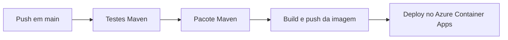
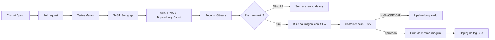

# Pipeline DevSecOps — Ford Challenge

## Escopo e estado inicial

Base avaliada: `52565edf5d81beb593c1cb78f8d23e49820cd076`. O fluxo inicial em `.github/workflows/deploy.yml` executa somente em `push` para `main`: testes Maven, pacote, build e push da imagem e deploy no Azure Container Apps. Não havia SAST, SCA, secret scanning ou análise de container.

## Fluxo atual



## Fluxo proposto



## Etapas, entradas e riscos

| Etapa | Entrada | Risco reduzido | Resultado esperado |
|---|---|---|---|
| Testes | Código e perfil `test` | Regressões funcionais antes do deploy | Relatórios Surefire; falha bloqueia dependentes |
| SAST | Código Java/Spring e configuração | Injeções, uso inseguro de APIs e segredos no código | Semgrep bloqueia achados e gera SARIF |
| SCA | `pom.xml` e árvore Maven | Bibliotecas com vulnerabilidades conhecidas | Dependency-Check falha em CVSS >= 7 e gera HTML |
| Atualização | Maven e GitHub Actions | Permanência em versões antigas | Dependabot abre PRs semanais; não substitui SCA |
| Secret scanning | Histórico Git completo | Credenciais e tokens versionados | Gitleaks falha sem revelar o valor detectado |
| Build | JAR e Dockerfile existente | Divergência entre artefato analisado e publicado | Imagem identificada pela tag imutável do commit |
| Container scan | Imagem local destinada ao deploy | CVEs HIGH/CRITICAL no runtime | Trivy bloqueia antes de qualquer push |
| Push/deploy | Imagem aprovada e credenciais protegidas | Deploy de artefato não verificado ou vindo de PR | Somente `push` em `main`; deploy usa tag SHA |

## Execução e gates integrados

O workflow executa testes, Semgrep, Dependency-Check e Gitleaks em `push` e `pull_request` para `main`. Cada job depende do anterior; qualquer falha impede os jobs seguintes. O job `deploy` exige todos os gates e também verifica `github.event_name == 'push' && github.ref == 'refs/heads/main'`. Assim, PR não confiável não recebe credenciais ACR/Azure e não publica ou implanta imagem.

Permissão global: `contents: read`. Somente o job SAST recebe `security-events: write` para publicar SARIF. Credenciais existentes permanecem em GitHub Secrets; esta frente não alterou segredos nem infraestrutura cloud.

No deploy, a imagem recebe a tag imutável `${{ github.sha }}`. Trivy verifica essa mesma referência local antes dos comandos `docker push`; HIGH/CRITICAL com correção disponível causa exit code 1. O deploy usa a tag SHA aprovada, não depende da tag mutável `latest`.

## Como reproduzir

```bash
mvn clean test -Dspring.profiles.active=test
mvn -B org.owasp:dependency-check-maven:check

gitleaks detect \
  --source . \
  --config .gitleaks.toml \
  --gitleaks-ignore-path .gitleaksignore \
  --redact

docker build -t carsync-api:sec-2026 .
trivy image --severity HIGH,CRITICAL --ignore-unfixed --exit-code 1 carsync-api:sec-2026
```

## Evidência observada em 2026-09-24

| Verificação | Ambiente | Resultado |
|---|---|---|
| Testes Maven | Local, Java 21 | 212 testes, 0 falhas, `BUILD SUCCESS` |
| Gitleaks 8.30.1 | Local | 151 commits e ~9,58 MB; zero vazamentos após exceções estreitas revisadas |
| Fixture sintética Gitleaks | Local, fora do repositório | 1 achado, exit code 1; fixture removida |
| Dependency-Check 9.0.0 | Local | Bloqueado: NVD HTTP 403 e ausência de dados locais |
| Semgrep | Local | Bloqueado: CLI ausente e Docker sem acesso ao daemon |
| Build/Trivy | Local | Bloqueado: acesso negado ao socket Docker; nenhum digest inventado |
| GitHub Actions | Remoto, commit `6947874` | [Run 36020010271](https://github.com/CarSync-ford/carsync-back/actions/runs/36020010271): testes e SAST aprovados; SCA reprovado; Gitleaks e deploy não executados |
| Deploy Azure | Remoto | Não executado; nenhum deploy declarado |

## Atualização de dependências — 2026-09-24

Após reprovação do SCA remoto no run `36020010271` (12 dependências vulneráveis, 163 achados) e nova reprovação no run `36046716450` com commit `c217e15` (8 arquivos, 7 componentes, 58 CVEs únicos devido a patches Spring 6.x Enterprise-only), a aplicação foi migrada para **Spring Boot 4.1.1** com suporte público continuado.

Versões publicadas no Maven Central e resolvidas por `mvn -B dependency:tree`:

| Componente | Antes (c217e15) | Spring Boot 4.1.1 |
|---|---|---|
| Spring Boot | 3.5.16 | 4.1.1 |
| Spring Framework | 6.2.19 | 7.0.9 (BOM) |
| Spring Security | 6.5.11 | 7.1.1 (BOM) |
| Spring Data JPA | 3.5.13 | 4.1.1 (BOM) |
| Tomcat (override) | 10.1.55 | 11.0.26 |
| Jackson aplicação | 2.21.4 | 3.1.5 (`tools.jackson`) |
| Jackson 2 transitivo | 2.21.4 | 2.21.5 (BOM compatível) |
| PostgreSQL JDBC | 42.7.11 | 42.7.13 (BOM) |
| Springdoc | 2.8.17 | 3.1.1 |
| Swagger UI (WebJar) | 5.32.2 | 5.32.15 (DOMPurify 3.4.13 empacotado) |
| Flyway | 10.21.0 | 12.4.0 (BOM) |
| Hibernate / Envers | 6.6.53.Final | 7.4.5.Final (BOM) |
| Commons Lang | 3.20.0 | 3.20.0 (BOM) |
| Log4j API / bridge | 2.25.5 | 2.25.5 (BOM) |

Adaptações necessárias de código e testes:
- `SecurityConfig.java`: `requiresChannel` substituído por `redirectToHttps(Customizer.withDefaults())` do Spring Security 7.
- Pacotes de teste migrados para módulos modulares Boot 4: `org.springframework.boot.webmvc.test.autoconfigure.AutoConfigureMockMvc`, `MockMvcPrint`, `TestRestTemplate` em `org.springframework.boot.resttestclient`, `DataJpaTest` em `org.springframework.boot.data.jpa.test.autoconfigure`, e `ObjectMapper` em `tools.jackson.databind`.
- `spring-boot-starter-flyway`, `spring-boot-starter-webmvc-test`, `spring-boot-data-jpa-test`, `spring-boot-restclient` e `spring-boot-starter-security-test` adicionados como starters modulares.
- `PayloadLimitTest`: `HttpStatus.PAYLOAD_TOO_LARGE` alinhado ao nome RFC 9110 `HttpStatus.CONTENT_TOO_LARGE`.
- `HttpsSecurityTest`: `RequestPostProcessor` definindo esquema HTTPS para `HttpsRedirectFilter`.

`mvn -B clean test -Dspring.profiles.active=test`: **BUILD SUCCESS**, 212 testes, zero falhas/erros/skips (38.5s). Flyway migrou 9 versões até v10 no H2. OpenAPI gerado com sucesso em `/v3/api-docs`.

Supressões do Dependency-Check permanecem vazias (`dependency-check-suppressions.xml`) e gate CVSS >= 7 inalterado. Novo scan de SCA deve ser executado no GitHub Actions com segredo `NVD_API_KEY` após autorização de publicação. Testes aprovados não substituem esse scan.

## Tratamento de falhas

- Semgrep encontra padrão inseguro: job SAST falha e SARIF é enviado quando permitido.
- Dependency-Check encontra CVSS >= 7: Maven falha e preserva o HTML quando produzido.
- Gitleaks encontra segredo não revisado: job falha; saída não deve revelar valor.
- Trivy encontra HIGH/CRITICAL corrigível: falha ocorre antes do push, logo deploy não inicia.
- Falha de scanner por infraestrutura também bloqueia o fluxo; não é convertida em aprovação.

Dependabot e Dependency-Check não duplicam função: Dependabot propõe atualização de versões; Dependency-Check compara dependências resolvidas com bases de vulnerabilidades.

## Limites e riscos residuais

Scanners reduzem classes conhecidas de risco, mas não substituem revisão humana, testes de autorização ou validação em produção. `ignore-unfixed: true` evita gate sem ação corretiva disponível, portanto CVEs sem correção permanecem risco residual. Allowlists do Gitleaks são limitadas ao cache Graphify e a cinco fingerprints históricos revisados; novos achados continuam bloqueados. Novo SCA após atualização das dependências, digest de imagem e deploy real ainda precisam ser verificados, sem simulação.
