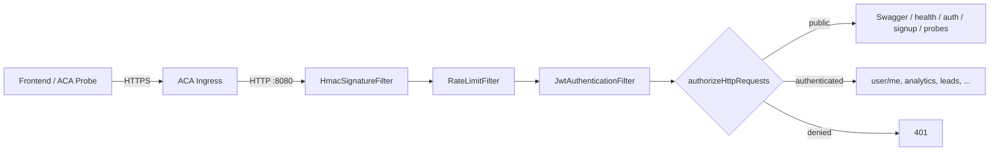

# Actuator + Refactor do SecurityConfig

## Problem Statement

O backend não expõe endpoints padrão de liveness/readiness, então as probes
do Azure Container Apps não conseguem distinguir um container saudável de um
container que subiu mas perdeu acesso ao banco — o `/api/v1/health` artesanal
sempre retorna `200`. Em paralelo, o `SecurityConfig` libera todo o prefixo
`/api/v1/**` em `permitAll`, deixando endpoints de negócio (analytics, leads,
customer360, etc.) acessíveis sem JWT. Ambos os problemas precisam ser
resolvidos juntos porque o refactor de segurança precisa acomodar os novos
paths do Actuator.

## Requirements

1. Expor apenas `/actuator/health/liveness` e `/actuator/health/readiness`.
   Demais endpoints do Actuator (`/actuator/env`, `/actuator/beans`, etc.)
   não devem ser acessíveis.
2. Manter Actuator na mesma porta da aplicação (`8080`), alinhado ao modelo
   single-port do ACA.
3. Tornar a allowlist do Spring Security explícita por endpoint:
   - **Públicos (sem JWT):** Swagger/OpenAPI, `GET /api/v1/health`,
     `POST /api/v1/auth/**` (login), `POST /api/v1/user` (cadastro),
     `/actuator/health/liveness`, `/actuator/health/readiness`.
   - **Autenticados (com JWT):** todo o resto, incluindo
     `GET /api/v1/user/me` e os controllers de negócio
     (`/api/v1/analytics/**`, `/api/v1/stock/**`, `/api/v1/churn/**`,
     `/api/v1/customer360/**`, `/api/v1/leads/**`, `/api/v1/assistant/**`).

## Background

- O Spring Boot Actuator 3.x expõe os endpoints de probes via
  `management.endpoint.health.probes.enabled=true`, que ativa automaticamente
  os grupos `liveness` e `readiness` em `/actuator/health/{liveness,readiness}`.
  O Spring entrega `LivenessStateHealthIndicator` e
  `ReadinessStateHealthIndicator` por padrão; com
  `spring-boot-starter-data-jpa` no classpath, o readiness passa a depender do
  `DataSourceHealthIndicator`, ou seja, falha de banco derruba o readiness
  automaticamente — exatamente o comportamento que falta hoje.
- Para esconder os outros endpoints, basta
  `management.endpoints.web.exposure.include=health` (apenas health exposto
  via HTTP). Os grupos liveness/readiness ficam sob o subpath de health,
  então essa única exposição já é suficiente.
- No Spring Security 6, matchers por método HTTP
  (`HttpMethod.POST, "/api/v1/user"`) são a forma idiomática de diferenciar
  `POST /api/v1/user` (público — cadastro) de `GET /api/v1/user/me`
  (autenticado).
- O `application.yml` de teste (`src/test/resources/application.yml`) precisa
  receber as mesmas chaves de management para que os testes integrem o
  Actuator corretamente.
- Configuração das probes do lado Azure (Bicep/Portal) fica fora deste plano —
  apenas deixar os endpoints prontos para serem apontados.

## Proposed Solution

Adicionar `spring-boot-starter-actuator` ao `pom.xml`, ativar probes em
`application.yml`, e reescrever o bloco `authorizeHttpRequests` do
`SecurityConfig` com matchers explícitos por endpoint e método HTTP.
Cobertura de testes em incrementos: primeiro um teste que prova que as probes
respondem `200` sem auth; depois testes que provam que endpoints de negócio
passam a exigir JWT; por fim, teste que prova que endpoints sensíveis do
Actuator (`/actuator/env`) ficam invisíveis.



## Task Breakdown

### Task 1: Adicionar dependência do Actuator e configurar probes

- **Objetivo:** Trazer o starter do Actuator para o classpath e habilitar
  exclusivamente os grupos `liveness` e `readiness` na porta `8080`.
- **Implementação:**
  - Adicionar `spring-boot-starter-actuator` ao `pom.xml`.
  - Em `src/main/resources/application.yml` (e
    `src/test/resources/application.yml`), adicionar:
    ```yaml
    management:
      endpoints:
        web:
          exposure:
            include: health
      endpoint:
        health:
          probes:
            enabled: true
          show-details: never
      health:
        livenessstate:
          enabled: true
        readinessstate:
          enabled: true
    ```
  - `show-details: never` evita vazar nomes de health indicators e estado do
    banco em respostas anônimas.
- **Testes:**
  - Test de integração `ActuatorProbesTest` verificando
    `GET /actuator/health/liveness` → `200` com body contendo
    `"status":"UP"`, sem JWT.
  - Idem para `/actuator/health/readiness`.
  - Teste verificando `GET /actuator/env` → `404` (não exposto).
- **Demo:** `curl http://localhost:8080/actuator/health/liveness` retorna
  `{"status":"UP"}`. `curl http://localhost:8080/actuator/env` retorna `404`.
  Aplicação continua subindo normalmente, sem regressão nos endpoints
  existentes.

### Task 2: Refactor do `SecurityConfig` — allowlist explícita

- **Objetivo:** Substituir o catch-all `/api/v1/**` permitAll por uma
  allowlist mínima, garantindo que qualquer rota não declarada exija JWT.
- **Implementação em `SecurityConfig.filterChain`:**
  ```java
  http.authorizeHttpRequests(auth -> auth
      // Públicos: docs
      .requestMatchers("/swagger-ui/**", "/swagger-ui.html", "/v3/api-docs/**").permitAll()
      // Públicos: probes ACA
      .requestMatchers("/actuator/health/liveness", "/actuator/health/readiness").permitAll()
      // Públicos: health legado da aplicação
      .requestMatchers(HttpMethod.GET, "/api/v1/health").permitAll()
      // Públicos: login e cadastro
      .requestMatchers("/api/v1/auth/**").permitAll()
      .requestMatchers(HttpMethod.POST, "/api/v1/user").permitAll()
      // Tudo o mais sob /api/v1 e qualquer outra rota exige JWT
      .anyRequest().authenticated()
  );
  ```
  - Remover o matcher redundante
    `.requestMatchers("/api/v1/user/me").authenticated()` (passa a ser
    coberto pelo `anyRequest().authenticated()`).
  - Manter a allowlist do CORS, do CSRF disable e a ordem dos filtros
    (HMAC → RateLimit → JWT) intacta.
- **Testes em `SecurityConfigTest` (novo) ou estendendo
  `JwtAuthenticationFilterTest`:**
  - `GET /api/v1/leads` sem `Authorization` → `401`.
  - `GET /api/v1/leads` com JWT válido → `200`/`404` (depende do controller,
    mas não `401`).
  - `POST /api/v1/user` (cadastro) sem JWT → continua funcionando (`201`).
  - `POST /api/v1/auth` sem JWT → continua funcionando (`200`/`401` por
    credenciais, não por filtro).
  - `GET /api/v1/user/me` sem JWT → `401`.
  - `GET /api/v1/health` sem JWT → `200`.
- **Demo:** o frontend continua conseguindo logar/cadastrar sem token;
  chamadas a endpoints de negócio sem `Authorization` agora retornam `401`
  em JSON padronizado pelo `GlobalExceptionHandler`; chamadas com JWT
  válido funcionam como antes.

### Task 3: Atualizar testes existentes que assumiam o catch-all permitAll

- **Objetivo:** Encontrar e corrigir testes que hoje passam apenas porque
  tudo em `/api/v1/**` é público, evitando que o refactor da Task 2 quebre
  a suíte.
- **Implementação:**
  - Rodar `mvn test` após Task 2 e identificar testes vermelhos (provável:
    `LeadControllerTest`, `AnalyticsControllerTest`,
    `Customer360ControllerTest`, etc., se existirem; `UserControllerTest`
    para `GET /me`).
  - Para cada teste de endpoint protegido, adicionar `@WithMockUser` ou
    injetar um JWT válido via `JwtService` em um `@BeforeEach`.
  - Para os controllers de negócio que ainda não têm `@PreAuthorize`,
    decidir caso a caso: deixar apenas `authenticated()` (qualquer JWT
    serve) ou já adicionar `@PreAuthorize("hasRole('USER')")` para alinhar
    com o RBAC já existente em `/me`.
- **Testes:** a própria suíte existente é o teste — todos os módulos
  voltando ao verde após os ajustes.
- **Demo:** `mvn test` verde, com cobertura demonstrando que os endpoints
  de negócio agora exigem autenticação na suíte automatizada.

### Task 4: Wiring final e verificação ponta-a-ponta

- **Objetivo:** Confirmar que o conjunto Actuator + Refactor está coeso e
  pronto para o ACA configurar as probes.
- **Implementação:**
  - Rodar `mvn clean verify` localmente.
  - Subir o container via `docker build` + `docker run` e validar
    manualmente:
    - `curl :8080/actuator/health/liveness` → `200`.
    - `curl :8080/actuator/health/readiness` → `200`.
    - Derrubar o Postgres (parar o container do banco) e verificar que
      `readiness` passa a `503` enquanto `liveness` permanece `200`.
    - `curl :8080/api/v1/leads` → `401`.
    - `curl -H "Authorization: Bearer <token>" :8080/api/v1/leads` →
      resposta normal.
  - Atualizar `SECURITY_CHANGES.md` (seção "Telemetria e Monitoramento de
    Saúde") removendo a observação de pendência do Actuator.
  - Documentar no README ou em `features/` os paths que o time de infra
    deve apontar nas probes do ACA:
    `livenessProbe.httpGet.path=/actuator/health/liveness`,
    `readinessProbe.httpGet.path=/actuator/health/readiness`, ambos na
    porta `8080`.
- **Testes:** nenhum novo; a verificação manual + suíte verde da Task 3
  fecha o ciclo.
- **Demo:** container local respondendo `200` em liveness mesmo com banco
  fora, mas `503` em readiness — comportamento exato que o ACA precisa
  para tirar o pod da rotação sem matá-lo desnecessariamente.
  Documentação atualizada para o time de infra.

# Regras
- Antes de começar as Tasks, crie uma nova branch com base na main chamada feat/actuator
- Deve ser realizado um commit antes de começar as tasks, adicionando este arquivo de features
- Para cada uma das tasks realizadas, deve ser feito um commit utilizando conventional commits, com uma mensagem de apenas uma linha em inglês sobre a alteração. Ex: "feat: actuator adicionado como dependência"
- Ao fim das tasks, rode os testes e verifique se é necessário fazer algum fix
- Crie um PR ao fim da feature, seguindo o prompt em ./.github/PullRequestSummarizer.md
