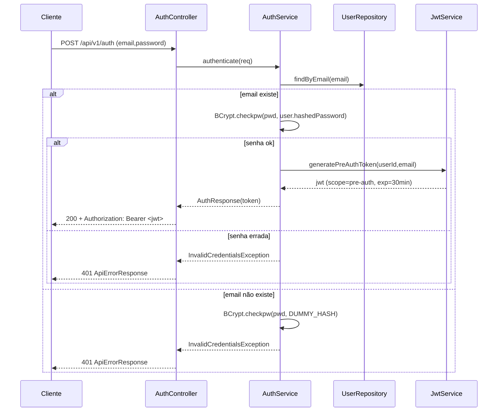

# Spec: POST /api/v1/auth — Login com JWT Pré-Auth

**Data:** 12/05/2026  
**Autor:** Enzo  
**Branch:** `feat/auth-user`

---

## 1. Objetivo

Implementar fluxo de login via `POST /api/v1/auth` que valida credenciais (email + senha) contra a tabela `users` e emite um JWT pré-auth de 30 minutos destinado à futura etapa de MFA. Suporta `application/json` e `application/x-www-form-urlencoded`, nunca atualiza `last_login`, aplica contramedida anti-timing com dummy bcrypt e retorna header HTTP padrão `Authorization: Bearer <token>`.

### Decisões fechadas com o usuário (resolvendo ambiguidades do enunciado original)

- Identificador de login: **email** (não username); o texto original que mencionava `username` nos cenários de teste foi normalizado para email.
- Validação de tamanho: `email` 5–254 caracteres (formato válido); `password` 6–20 caracteres. No login **não** se aplica `@StrongPassword` (essa regra é exclusiva do cadastro).
- JWT é **pré-auth estrito**: contém claim `scope=pre-auth` e só servirá, no futuro, para chamar um endpoint de verificação de MFA (fora do escopo desta feature).
- `last_login` **não é atualizado** em nenhuma hipótese (nem sucesso nem falha).
- Corpo de erro segue o `ApiErrorResponse` já existente no projeto.
- Header de resposta: padrão HTTP `Authorization: Bearer <token>` (typos da spec original foram corrigidos).

---

## 2. Alterações no Banco de Dados

Sem alterações no schema. A tabela `users` (migração `V2__create_user_tables.sql`) já possui `email`, `hashed_password` e `last_login`.

---

## 3. Contrato da API

| Método | Path | Descrição | Status |
|--------|------|-----------|--------|
| POST | `/api/v1/auth` | Autenticar credenciais e emitir JWT pré-auth | 200 / 400 / 401 |

**Content-Types suportados no request:** `application/json`, `application/x-www-form-urlencoded`  
**Content-Types suportados no response:** `application/json`, `application/xml`

**Request JSON:**
```json
{
  "email": "joaopereira@example.com",
  "password": "Senha@123"
}
```

**Request form-urlencoded:**
```
email=joaopereira@example.com&password=Senha%40123
```

**Response 200:**
- Header: `Authorization: Bearer <jwt>`
- Body:
```json
{ "token": "<jwt>" }
```

**Response 401 (genérica — mesma para email inexistente e senha incorreta):**
```json
{
  "timestamp": "2026-05-12T20:30:00",
  "status": 401,
  "error": "Unauthorized",
  "message": "Credenciais inválidas: Usuário não encontrado ou senha incorreta",
  "path": "/api/v1/auth",
  "details": []
}
```

**Response 400 (validação de payload):**
Formato `ApiErrorResponse` com `details` listando os campos inválidos.

### JWT

- Algoritmo: `HS256` (biblioteca `io.jsonwebtoken:jjwt` v0.12.6).
- Claims: `sub=userId`, `email`, `scope=pre-auth`, `iss=carsync-auth`, `iat`, `exp`.
- Duração: 30 minutos.
- Segredo e configs carregados via `.env`.

---

## 4. DTOs

**Arquivo:** `dto/AuthDtos.java`

```java
public final class AuthDtos {
    private AuthDtos() {}

    public record AuthRequest(
        @NotBlank @Email @Size(min = 5, max = 254) String email,
        @NotBlank @Size(min = 6, max = 20) String password
    ) {}

    public record AuthResponse(
        String token
    ) {}
}
```

> Observação: remover o diretório vazio `src/main/java/br/com/sprint1/challenge/dto/AuthDtos/` ao criar o arquivo `AuthDtos.java`.

---

## 5. Regras de Negócio

1. Buscar usuário por email. Se não existir, executar `BCrypt.checkpw(senhaRecebida, DUMMY_HASH)` (resultado descartado) e lançar `InvalidCredentialsException`. Essa execução garante tempo de resposta equivalente ao caminho feliz, prevenindo enumeração por timing.
2. Se o usuário existir, validar a senha com `BCrypt.checkpw(senhaRecebida, user.hashedPassword)`. Se falhar, lançar `InvalidCredentialsException`.
3. Em sucesso, gerar JWT via `JwtService.generatePreAuthToken(userId, email)` com `scope=pre-auth` e `exp = now + 30min`.
4. **Nunca chamar `userRepository.save`** — `last_login` permanece inalterado (tanto em sucesso quanto em falha).
5. `DUMMY_HASH` é pré-computado uma única vez no `@PostConstruct` do `AuthServiceImpl` como `BCrypt.hashpw("__dummy__", BCrypt.gensalt(bcryptRounds))`.
6. Não é permitido diferenciar a causa da falha de credenciais na mensagem retornada ao cliente — a mensagem é sempre a genérica definida na seção 3.
7. Configurações JWT devem vir exclusivamente de `.env` (via `JwtProperties` com `@ConfigurationProperties(prefix = "jwt")`): `JWT_SECRET`, `JWT_PRE_AUTH_EXPIRATION_MINUTES=30`, `JWT_ISSUER=carsync-auth`.

**Exceções esperadas:**
- `InvalidCredentialsException` (nova, `exception/InvalidCredentialsException.java`) → 401.
- `MethodArgumentNotValidException` (Bean Validation) → 400 (já tratada no `GlobalExceptionHandler`).

---

## 6. Arquitetura e Componentes (novo domínio `auth`)

Respeitando `CONVENTIONS.md` (Controller → Service → ServiceImpl → Repository; DTOs obrigatórios; errors via `GlobalExceptionHandler`).

Arquivos a criar/modificar:

```
controller/AuthController.java                  [novo]
dto/AuthDtos.java                               [novo]
service/AuthService.java                        [novo]
service/JwtService.java                         [novo]
service/impl/AuthServiceImpl.java               [novo]
service/impl/JwtServiceImpl.java                [novo]
config/JwtProperties.java                       [novo] @ConfigurationProperties(prefix="jwt")
exception/InvalidCredentialsException.java      [novo]
exception/GlobalExceptionHandler.java           [editar] handler 401
repository/UserRepository.java                  [editar] + Optional<User> findByEmail(String)
pom.xml                                         [editar] + jjwt 0.12.6 (api, impl, jackson)
application.yml                                 [editar] + bloco jwt:
.env / .env.example                             [editar] + JWT_SECRET, JWT_PRE_AUTH_EXPIRATION_MINUTES, JWT_ISSUER
ArquiteturaOrientadaaServicosSprint1Application [editar] + @EnableConfigurationProperties(JwtProperties.class)
```

### Fluxo



---

## 7. Testes

**Abordagem TDD obrigatória** — testes são escritos **antes** de qualquer implementação. Cada task segue: `RED (testes) → stubs mínimos para compilar → GREEN (implementação) → mvn clean test verde → commit`.

### 7.1 `repository/UserRepositoryTest.java` (`@DataJpaTest`)
- [ ] `findByEmail_quandoExiste_retornaUsuario`
- [ ] `findByEmail_quandoInexiste_retornaEmpty`

### 7.2 `service/JwtServiceTest.java` (`@SpringBootTest` + `@TestPropertySource`)
- [ ] `geraToken_claimsSubEmailScopeIssBatem`
- [ ] `geraToken_expAproxAgoraMais30min` (tolerância 2s)
- [ ] `parse_tokenValido_retornaClaims`
- [ ] `parse_tokenAssinadoComOutroSegredo_lancaException`
- [ ] `parse_tokenExpirado_lancaException`

### 7.3 `service/AuthServiceTest.java` (Mockito puro)
- [ ] `autenticacaoComSucesso_retornaTokenENaoAtualizaLastLogin` — verifica que `userRepository.save` **nunca** é invocado
- [ ] `emailInexistente_executaBcryptFakeELancaInvalidCredentials` — `JwtService.generate*` nunca invocado
- [ ] `senhaIncorreta_lancaInvalidCredentials` — `generate*` nunca invocado
- [ ] `emailNuloOuVazio_lancaInvalidCredentials`

### 7.4 `controller/AuthControllerTest.java` (`@SpringBootTest + @AutoConfigureMockMvc + @Transactional`)
Fixture `@BeforeEach`: seed de `UserType` (`USER`) e `User(email="joaopereira@example.com", hashedPassword=BCrypt("Senha@123"), lastLogin=null)`.

- [ ] `postJsonValido_retorna200HeaderAuthorizationEBodyToken`
- [ ] `postFormUrlEncodedValido_retorna200HeaderAuthorizationEBodyToken`
- [ ] `postEmailInexistente_retorna401ComMensagemGenerica`
- [ ] `postSenhaIncorreta_retorna401ComMesmaMensagemGenerica`
- [ ] `postEmailFormatoInvalido_retorna400`
- [ ] `postSenhaMenorQue6_retorna400`
- [ ] `postSenhaMaiorQue20_retorna400`
- [ ] `postCamposAusentes_retorna400`
- [ ] `aposLoginSucesso_lastLoginPermaneceNulo` (consulta o repositório após o request)
- [ ] `tokenEmitidoTemScopePreAuthEExp30min` (parse via `JwtService` injetado)

---

## 8. Critérios de Aceite

- [ ] `mvn clean test` verde em toda a suite.
- [ ] Endpoint responde em JSON e XML (produce) e aceita JSON e form-urlencoded (consume).
- [ ] Header `Authorization: Bearer <token>` presente na resposta 200.
- [ ] Falhas de credenciais retornam 401 com **a mesma** mensagem genérica, independentemente da causa real.
- [ ] `last_login` permanece inalterado após qualquer login (validado por teste).
- [ ] Configuração JWT carregada exclusivamente via `.env` / `JwtProperties`.
- [ ] Swagger documenta o novo endpoint, incluindo nota sobre `scope=pre-auth` (próxima etapa: verificação MFA — feature futura).
- [ ] Todos os testes foram escritos **antes** da implementação correspondente (TDD).
- [ ] Cada task concluída gera um commit em Conventional Commits (inglês) na branch `feat/auth-user`.

---

## 9. Task Breakdown (TDD + commit por task)

Fluxo padrão de cada task onde há código Java: **RED (testes primeiro)** → stubs mínimos para compilar → **GREEN (implementação)** → `mvn clean test` verde → commit.

### Task 1: Infraestrutura pura — dependências JWT, env vars e properties YAML
- Objetivo: preparar toolchain sem introduzir classes Java.
- Ações:
  1. Adicionar em `pom.xml`: `io.jsonwebtoken:jjwt-api:0.12.6`, `jjwt-impl:0.12.6` (runtime), `jjwt-jackson:0.12.6` (runtime).
  2. Adicionar em `.env` e `.env.example`: `JWT_SECRET=<dev-secret-base64-com-32+bytes>`, `JWT_PRE_AUTH_EXPIRATION_MINUTES=30`, `JWT_ISSUER=carsync-auth`.
  3. Adicionar bloco `jwt:` em `application.yml` lendo as env vars com defaults de dev.
- Validação: `mvn clean compile` ok; `mvn spring-boot:run` sobe sem erro. Nenhum teste novo nesta task.
- Demo: aplicação sobe com as novas propriedades no Environment.
- Commit: `chore(auth): add jjwt dependency and jwt env configuration`

### Task 2: Repositório — `findByEmail`
- RED: criar `repository/UserRepositoryTest.java` (`@DataJpaTest`) com `findByEmail_quandoExiste_retornaUsuario` e `findByEmail_quandoInexiste_retornaEmpty`. `mvn test` falha na compilação.
- GREEN: adicionar `Optional<User> findByEmail(String email);` em `UserRepository`.
- Validação: `mvn test -Dtest=UserRepositoryTest` verde; `mvn clean test` suite completa verde.
- Demo: teste unitário do repositório passa.
- Commit: `feat(user): add findByEmail query to UserRepository`

### Task 3: `JwtService` + `JwtProperties`
- RED: criar `service/JwtServiceTest.java` com os 5 casos listados em 7.2 (tests falham na compilação).
- Stubs para compilar (permanecem RED em runtime):
  - `config/JwtProperties.java` — `@ConfigurationProperties(prefix="jwt")` com `secret`, `preAuthExpirationMinutes`, `issuer`.
  - Registrar `@EnableConfigurationProperties(JwtProperties.class)` na classe principal.
  - `service/JwtService.java` interface: `String generatePreAuthToken(String userId, String email)`, `Claims parse(String token)`.
  - `service/impl/JwtServiceImpl.java` lançando `UnsupportedOperationException`.
- GREEN: implementar `JwtServiceImpl` usando `Jwts.builder()` com `Keys.hmacShaKeyFor(secret.getBytes(UTF_8))` e `Jwts.SIG.HS256`; `exp = now + minutes*60_000`; parse com `Jwts.parser().verifyWith(key).build().parseSignedClaims(token).getPayload()`.
- Validação: `mvn clean test` verde.
- Demo: token gerado pode ser inspecionado em jwt.io com as claims esperadas.
- Commit: `feat(auth): add JwtService for pre-auth token issuance and parsing`

### Task 4: `AuthService` + `AuthDtos` + `InvalidCredentialsException`
- RED: criar `service/AuthServiceTest.java` com os 4 casos listados em 7.3 (Mockito). Tests falham na compilação.
- Stubs para compilar:
  - `dto/AuthDtos.java` com `AuthRequest(@NotBlank @Email @Size(min=5,max=254) String email, @NotBlank @Size(min=6,max=20) String password)` e `AuthResponse(String token)`.
  - Remover diretório vazio `src/main/java/br/com/sprint1/challenge/dto/AuthDtos/`.
  - `exception/InvalidCredentialsException.java` (`extends RuntimeException` com mensagem fixa genérica).
  - `service/AuthService.java` interface (`AuthResponse authenticate(AuthRequest req)`).
  - `service/impl/AuthServiceImpl.java` lançando `UnsupportedOperationException`.
- GREEN: implementar `AuthServiceImpl`:
  - Injeta `UserRepository`, `JwtService`, `@Value("${spring.bcrypt.salt:10}") int bcryptRounds`.
  - `@PostConstruct`: `DUMMY_HASH = BCrypt.hashpw("__dummy__", BCrypt.gensalt(bcryptRounds))`.
  - `authenticate`: find por email → se ausente, roda `BCrypt.checkpw(pwd, DUMMY_HASH)` (resultado descartado) e lança `InvalidCredentialsException`; se presente, roda `BCrypt.checkpw(pwd, user.getHashedPassword())` — falha lança exceção; em sucesso retorna `new AuthResponse(jwtService.generatePreAuthToken(user.getId(), user.getEmail()))`. Nunca chamar `save`.
- Validação: `mvn clean test` verde, incluindo asserção de que `userRepository.save` nunca é invocado.
- Demo: teste unitário do service passa.
- Commit: `feat(auth): add AuthService with credential validation and anti-timing dummy hash`

### Task 5: `AuthController` + exception handler 401 + wiring final
- RED: criar `controller/AuthControllerTest.java` (`@SpringBootTest + @AutoConfigureMockMvc + @Transactional`) com todos os casos listados em 7.4. Fixture `@BeforeEach` seed de `UserType` + `User(email="joaopereira@example.com", hashedPassword=BCrypt("Senha@123"), lastLogin=null)`.
- Stubs para compilar:
  - `AuthController` skeleton em `/api/v1/auth` com dois `@PostMapping` (consumes JSON e FORM_URLENCODED) retornando `ResponseEntity.status(501).build()`.
  - Placeholder `@ExceptionHandler(InvalidCredentialsException.class)` em `GlobalExceptionHandler` retornando 501.
- GREEN: implementar:
  - `@RestController @RequestMapping(value="/api/v1/auth", produces={JSON, XML})`.
  - JSON handler: `@PostMapping(consumes=APPLICATION_JSON_VALUE)` com `@Valid @RequestBody AuthRequest`.
  - Form handler: `@PostMapping(consumes=APPLICATION_FORM_URLENCODED_VALUE)` com `@Valid @ModelAttribute AuthRequest`.
  - Ambos delegam a `authService.authenticate(req)` e retornam `ResponseEntity.ok().header("Authorization", "Bearer " + resp.token()).body(resp)`.
  - Anotações OpenAPI (`@Operation`, `@ApiResponses` 200/400/401) documentando `scope=pre-auth` e etapa futura de verificação MFA.
  - `GlobalExceptionHandler.handleInvalidCredentials`: retorna `401 Unauthorized` com `ApiErrorResponse(message="Credenciais inválidas: Usuário não encontrado ou senha incorreta", details=List.of())`.
- Validação: `mvn clean test` suite completa verde. Validação manual:
  - `curl -i -X POST localhost:8080/api/v1/auth -H 'Content-Type: application/json' -d '{"email":"joaopereira@example.com","password":"Senha@123"}'`
  - `curl -i -X POST localhost:8080/api/v1/auth -d 'email=joaopereira@example.com&password=Senha%40123'`
  - `curl -i -X POST localhost:8080/api/v1/auth -H 'Content-Type: application/json' -d '{"email":"x@x.com","password":"errada"}'` (401 genérico)
- Demo: endpoint responde em JSON e form; 401 genérico em falhas; Swagger lista o endpoint.
- Commit: `feat(auth): add POST /api/v1/auth endpoint with JSON and form-urlencoded support`
