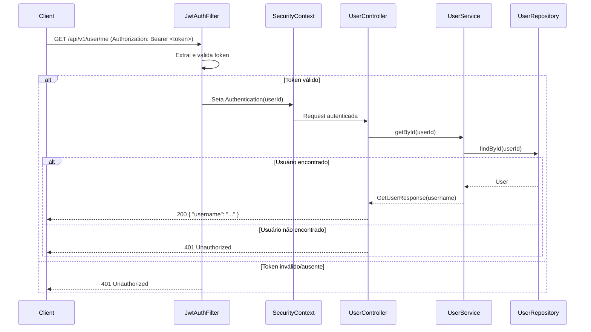

create get user route.
must have a auth token to hit the route.
user_id is provided in the token.
return payload with user name.

---

## Implementation Plan - GET /api/v1/user/me

**Problem Statement:**
Criar uma rota autenticada `GET /api/v1/user/me` que valida o token JWT via filtro Spring Security, extrai o `user_id` do subject do token, busca o usuário no banco e retorna o `username`. Retorna 401 para token inválido/ausente ou usuário não encontrado.

**Requirements:**
- Rota `GET /api/v1/user/me` protegida por autenticação JWT
- Token JWT enviado no header `Authorization: Bearer <token>`
- `user_id` extraído do subject do token (já implementado no `JwtServiceImpl`)
- Response: `{ "username": "..." }`
- 401 Unauthorized para: token ausente, token inválido/expirado, usuário não encontrado
- Filtro de segurança (`JwtAuthenticationFilter`) para validar o token
- Testes escritos antes da implementação (TDD)
- A cada task concluida, deve ser feito um commit
- Ao terminar todas as tasks e os testes passarem, deve ser gerado um pull request da forma como descrito em ./.github/PullRequestSummarizer.md

**Background:**
- O projeto usa Spring Boot 3.3.2 com Spring Security, JWT (jjwt 0.12.6)
- `JwtService.parse(token)` já retorna `Claims` com `subject` = userId
- `UserRepository` já tem `findById(String id)` via JpaRepository
- `SecurityConfig` atualmente permite tudo em `/api/v1/**` — precisa restringir `/api/v1/user/me`
- Testes usam `@SpringBootTest` + `MockMvc` + H2 in-memory
- O `application.yml` de teste NÃO tem as propriedades JWT — os testes de JWT usam `@TestPropertySource`

**Proposed Solution:**
Implementar com abordagem TDD: escrever os testes primeiro (red), depois implementar o código mínimo para fazê-los passar (green), e refatorar se necessário (refactor).

**Task Breakdown:**

**Task 1: Escrever testes do JwtAuthenticationFilter e implementá-lo**
- Objetivo: Criar o filtro que valida JWT e seta autenticação no SecurityContext
- Testes primeiro (RED):
  - Criar `src/test/java/br/com/sprint1/challenge/config/JwtAuthenticationFilterTest.java`
  - Teste: header Authorization com token válido → seta Authentication no SecurityContext com userId como principal
  - Teste: header Authorization com token inválido → não seta Authentication
  - Teste: sem header Authorization → não seta Authentication
  - Teste: header com formato errado (sem "Bearer ") → não seta Authentication
- Implementação (GREEN):
  - Criar `src/main/java/br/com/sprint1/challenge/config/JwtAuthenticationFilter.java`
  - Estender `OncePerRequestFilter`
  - Extrair token do header, usar `JwtService.parse()`, setar `UsernamePasswordAuthenticationToken` no contexto
- Demo: Testes passando — filtro valida token corretamente em isolamento

**Task 2: Escrever testes do UserService.getById e implementá-lo**
- Objetivo: Criar a lógica de busca de usuário por ID
- Testes primeiro (RED):
  - Adicionar testes em `UserServiceTest.java`:
  - Teste: `getById` com ID existente → retorna `GetUserResponse` com username
  - Teste: `getById` com ID inexistente → lança `ResourceNotFoundException`
- Implementação (GREEN):
  - Adicionar `record GetUserResponse(String username)` em `UserDtos.java`
  - Adicionar `GetUserResponse getById(String userId)` na interface `UserService`
  - Implementar em `UserServiceImpl`: buscar por ID, retornar username, lançar `ResourceNotFoundException` se não encontrado
- Demo: Testes unitários do service passando com mocks

**Task 3: Escrever testes de integração do endpoint e implementar controller + security config**
- Objetivo: Criar o endpoint e configurar a segurança
- Testes primeiro (RED):
  - Adicionar propriedades JWT no `src/test/resources/application.yml`
  - Adicionar testes em `UserControllerTest.java`:
  - Teste: `GET /api/v1/user/me` com token válido + usuário existe → 200 com `{ "username": "..." }`
  - Teste: `GET /api/v1/user/me` com token válido + usuário não existe → 401
  - Teste: `GET /api/v1/user/me` com token inválido → 401
  - Teste: `GET /api/v1/user/me` sem header Authorization → 401
- Implementação (GREEN):
  - Registrar `JwtAuthenticationFilter` no `SecurityConfig`
  - Alterar `authorizeHttpRequests`: exigir autenticação em `/api/v1/user/me`, manter demais rotas permitidas
  - Adicionar `@GetMapping("/me")` no `UserController` que extrai userId do `Authentication`, chama `userService.getById()`, e retorna 401 se usuário não encontrado
- Demo: Fluxo completo end-to-end — criar usuário via POST, gerar token via auth, acessar `GET /api/v1/user/me` e receber username. Todos os testes passando.