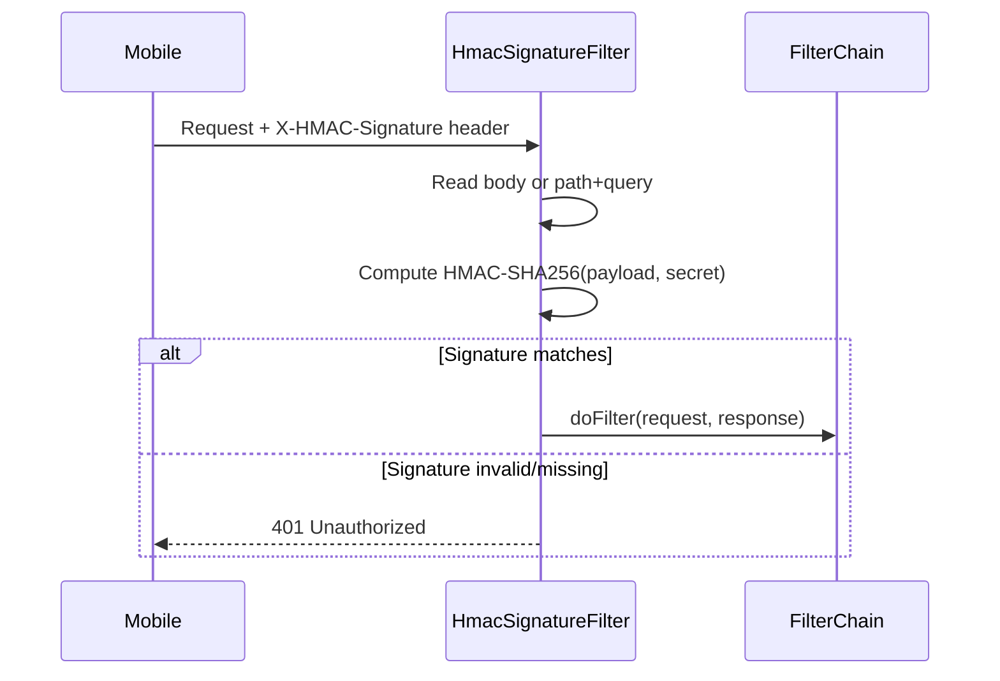

# HMAC Payload Signature Filter

## Problem Statement

Garantir a integridade e autenticidade das requisições vindas do app mobile, validando uma assinatura HMAC-SHA256 enviada no header `X-HMAC-Signature`.

## Requirements

- Algoritmo: HmacSHA256
- Header: `X-HMAC-Signature`
- Todas as rotas devem ser validadas
- Requisições com body: HMAC calculado sobre o body raw
- Requisições sem body: HMAC calculado sobre path + query string
- Chave secreta injetada via variável de ambiente (`HMAC_SECRET`) no ACA, configurada manualmente via script `az` no terminal
- Filtro desabilitável via property (para testes)

## Sequence Diagram

## Task Breakdown

### Task 1: Adicionar property de configuração HMAC

- `application.yml`: `hmac.secret: ${HMAC_SECRET:}` e `hmac.enabled: ${HMAC_ENABLED:true}`
- `application.yml` (test): `hmac.secret: test-hmac-secret` e `hmac.enabled: false`
- `.env.example`: adicionar `HMAC_SECRET`

### Task 2: Criar o HmacSignatureFilter

- `HmacSignatureFilter extends OncePerRequestFilter` no pacote `config`
- CachedBodyHttpServletRequest para leitura múltipla do body
- Requests com body → HMAC do body raw
- Requests sem body → HMAC de `requestURI` + `?` + `queryString`
- Comparação timing-safe com `MessageDigest.isEqual()`
- Testes unitários cobrindo todos os cenários

### Task 3: Registrar o filtro no SecurityConfig

- Injetar no construtor do SecurityConfig
- `addFilterBefore(hmacSignatureFilter, RateLimitFilter.class)`

### Task 4: Documentar comando de deploy da env var

- Comando `az containerapp update` para configurar `HMAC_SECRET` no ACA
